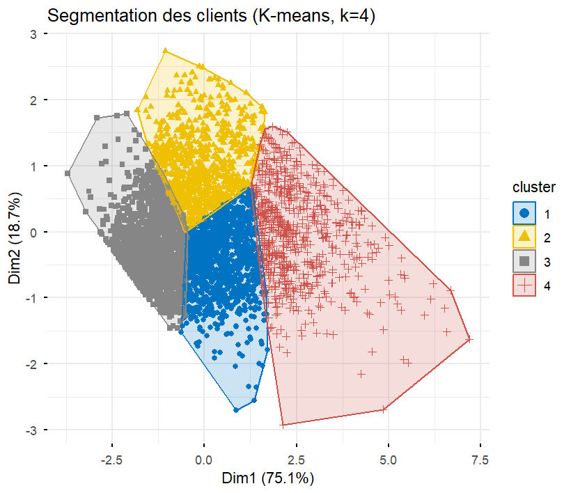

# Segmentation de la clientèle e-commerce (RFM + K-means)

Projet réalisé dans le cadre du module **Programmation R** Master 1 DATA-IA, Université Polytechnique de Bingerville.

Segmentation d'une base de 4 338 clients d'un site e-commerce britannique à partir de la méthode **RFM (Récence, Fréquence, Montant)** et d'un clustering **K-means**, validé par un clustering hiérarchique (méthode de Ward).

## Aperçu des résultats

Quatre segments de clients ont été identifiés :

| Segment | Clients | Récence moy. | Fréquence moy. | Montant moy. |
|---|---|---|---|---|
| Champions | 723 (16,7 %) | 12,5 jours | 13,6 commandes | 8 013 £ |
| Fidèles réguliers | 1 158 (26,7 %) | 69,3 jours | 4,13 commandes | 1 810 £ |
| Récents / occasionnels | 878 (20,2 %) | 20,5 jours | 2,05 commandes | 530 £ |
| Inactifs / perdus | 1 579 (36,4 %) | 188,0 jours | 1,33 commande | 352 £ |



## Structure du dépôt

```
segmentation-clients-rfm/
├── R/
│   └── segmentation_clients_rfm.R   # script complet, de l'import à l'export
├── rapport/
│   └── Rapport_Segmentation_Clients_RFM.pdf
├── figures/
│   └── ...                           # graphiques générés par le script
└── README.md
```

## Méthodologie

1. **Nettoyage** : suppression des commandes sans client identifié, des retours (quantités négatives) et des prix aberrants → 397 884 lignes conservées (73,4 %), 4 338 clients sur 4 373 (99,2 %)
2. **Indicateurs RFM** : calcul de la Récence, Fréquence et Montant par client
3. **Détection des outliers** (méthode IQR) : jusqu'à 9,8 % de valeurs extrêmes sur le Montant
4. **Transformation** : log(1+x) puis standardisation, pour limiter l'effet des valeurs extrêmes sans supprimer de clients
5. **Choix de k** : méthode du coude + score de silhouette → k = 4
6. **Clustering** : K-means (k = 4), validé par un clustering hiérarchique (Ward) sur un échantillon de 500 clients
7. **Interprétation métier** : attribution automatique des labels de segment par tri des clusters selon le Montant moyen (robuste au réordonnancement aléatoire des clusters par K-means)

## Dataset

[Online Retail Data Set](https://archive.ics.uci.edu/dataset/352/online+retail) — UCI Machine Learning Repository. Transactions d'un site e-commerce britannique entre décembre 2010 et décembre 2011 (non inclus dans ce dépôt, à télécharger séparément).

## Reproduire l'analyse

```r
# Packages nécessaires
install.packages(c("readxl", "dplyr", "lubridate", "ggplot2",
                    "gridExtra", "factoextra", "tidyr"))

# Placer le fichier "Online Retail.xlsx" à la racine du projet,
# puis exécuter :
source("R/segmentation_clients_rfm.R")
```

## Rapport complet

Le rapport détaillé (méthodologie, résultats, interprétation métier, limites, bibliographie) est disponible dans [`rapport/Rapport_Segmentation_Clients_RFM.pdf`](rapport/Rapport_Segmentation_Clients_RFM.pdf).

## Auteur

**YAO MIÉZAN SAM WILLIAM** , Master 1 DATA-IA, Université Polytechnique de Bingerville
Encadrant : Dr. TALNAN 
Année académique : 2025-2026
